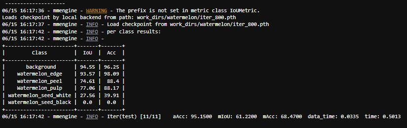
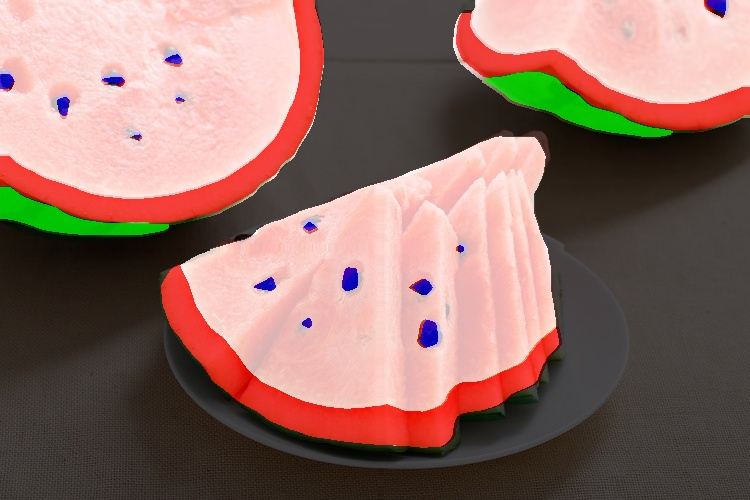

### 目录MMSegmentation_homework为训练营第9天MMSegmentation代码课程课后作业。
作业：MMSeg 语义分割
背景：西瓜瓤、西瓜皮、西瓜籽像素级语义分割

TO DO LIST：

Labelme 标注语义分割数据集（子豪兄已经帮你完成了）
划分训练集和测试集（子豪兄已经帮你完成了）
Labelme 标注转 Mask 灰度图格式（子豪兄已经帮你完成了）
使用 MMSegmentation 算法库，撰写 config 配置文件，训练 PSPNet 语义分割算法
提交测试集评估指标
自己拍摄西瓜图片和视频，将预测结果发到群里
（选做）训练 Segformer 语义分割算法，提交测试集评估指标
西瓜瓤、西瓜籽数据集：
标注：同济子豪兄

类别名称	类别语义	标注类别	灰度图像素值
/	背景	/	0
red	西瓜红瓤	多段线（polygon）	1
green	西瓜外壳	多段线（polygon）	2
white	西瓜白皮	多段线（polygon）	3
seed-black	西瓜黑籽	多段线（polygon）	4
seed-white	西瓜白籽	多段线（polygon）	5
数据集下载链接：

Labelme标注格式（没有划分训练集和测试集）：https://zihao-openmmlab.obs.cn-east-3.myhuaweicloud.com/20230130-mmseg/dataset/watermelon/Watermelon87_Semantic_Seg_Labelme.zip
Mask标注格式（已划分训练集和测试集）：https://zihao-openmmlab.obs.cn-east-3.myhuaweicloud.com/20230130-mmseg/dataset/watermelon/Watermelon87_Semantic_Seg_Mask.zip
需提交的测试集评估指标：（不能低于 baseline 指标的 50% ）
aAcc: 60.6200
mIoU: 21.1400
mAcc: 28.4600

西瓜瓤、西瓜皮、西瓜籽像素级语义分割.ipynb为主程序，mmsegmentation/watermelon_cfg.py为算法配置文件，测试集评估指标截图在根目录下 mmsegmentation西瓜测试集精度指标.jpg。

图片预测结果放在mmsegmentation/pred_rgb.jpg，视频预测结果放在mmsegmentation/seg_video.mp4。

<video src="mmsegmentation/seg_video.mp4"></video>